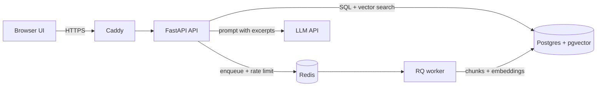

# DocuMind: Design

## 1. Requirements and assumptions
- Users sign up, upload PDF/TXT/MD (max 10 MB), ask questions, get cited answers.
- Ingestion is asynchronous. Answers come only from the user's own documents.
- Assumptions: English documents, small corpora (hundreds of docs per user), free-tier LLM.

## 2. Architecture

## 3. API contract
| Method | Path | Body / response |
|---|---|---|
| POST | /auth/signup, /auth/login | `{username,password}` -> `{access_token}` |
| POST | /documents | multipart file -> 202 `{id,filename,status}` |
| GET | /documents, /documents/{id} | status: queued/processing/ready/failed (+error) |
| DELETE | /documents/{id} | 204; chunks removed by FK cascade |
| POST | /ask | `{question, document_ids?}` -> `{answer, refused, citations[], usage{}}` |
| GET | /history | last 50 answers |
| GET | /health, /livez | dependency status (db, vector_store, queue, worker) |

## 4. Data model
users(id, username, password_hash) - documents(id uuid, user_id, filename, status, error, content) -
chunks(id, document_id, user_id, idx, page, content, embedding vector(384)) -
queries(id, user_id, question, answer, refused, citations json, tokens, latency_ms, cost_usd).
Every query filters by user_id; document IDs are UUIDs and 404 (not 403) for other users.

## 5. Key trade-offs
- pgvector over a separate vector DB: one service, transactional deletes, filter by user in SQL.
- Local embedding model (bge-small, 384-d): no API key, no rate limit, deterministic. Costs image size and RAM.
- Paragraph-aware chunks (~800 chars, 120 overlap): keeps passages readable as citations.
- Refusal has two gates: similarity threshold before the LLM, and a NOT_FOUND sentinel from the LLM.
- Prompt injection: excerpts wrapped as untrusted data, delimiter tags stripped from content, system rules say never follow excerpt instructions.
- RQ over Celery: much less configuration. Redis also backs the rate limiter.
- create_all at startup instead of migrations: fine for v1, Alembic is the next step.

## 6. Changes after implementation
What changed from the design above, and why:

- **SQLite for unit tests, Postgres everywhere else.** Tests and CI run on SQLite (JSON embedding column, cosine similarity computed in Python) so they need no database service. The real pgvector path is exercised by `scripts/smoke.sh` against the Docker stack.
- **Chunks never span pages.** Chunking is paragraph-aware (about 800 characters, 120 overlap) and restarts on each PDF page, so a citation's page number is exact.
- **Ingestion retries.** The RQ job retries twice with backoff on unexpected errors. Bad input (an encrypted or unreadable PDF, no text) fails immediately with a stored reason, because retrying cannot help.
- **Rate limiting fails closed.** Per-minute and per-day counters live in Redis. If Redis is down, `/ask` returns 503 instead of allowing unlimited LLM spend. A per-user cap of 50 documents was added.
- **Citations carry more fields.** Each citation has the excerpt number, document id, document name, page, chunk id, the passage and the similarity score.
- **Injection defence became layered, after the evaluation found a real leak.** The design had delimiter stripping and system rules. The evaluation showed the model obeying an injected instruction while still producing a valid citation, so a canary string in the system prompt and a stricter prompt (v2) were added. See EVALUATION.md.
- **The UI is one static page served by FastAPI at `/`**, so there is no separate frontend service.
- **Deployment adds Caddy** in a production compose overlay for automatic HTTPS. The API is bound to the loopback and reached by Caddy over the Docker network.
- **Still not done:** Alembic migrations (tables are created at start-up), streaming answers, hybrid search or re-ranking, and a measured load test.
